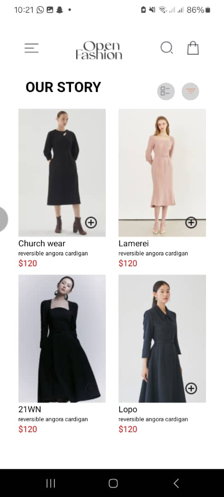
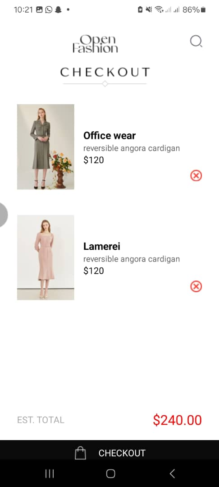

# rn-assignment6-11015722
# Description
This is a fashion app that uses basic react components such as component-based design, local storage with AsyncStorage, and state management with hooks.It has two screens, the homescreen and cartscreen.

# HomeScreen
-Shows a list of fashion items with images, names, descriptions, and prices.
-Users can add items to the cart with an "add to cart" button.
-The addToCart function saves items to AsyncStorage.

# CartScreen
-Displays items added to the cart.
-Shows item details: image, name, description, and price.
-Users can remove items from the cart with a "remove" button.
-The removeFromCart function deletes items from AsyncStorage.
-Shows the total price of items in the cart at the bottom of the screen.
-Includes a checkout button for proceeding with the purchase.

# Screenshots
Homescreen

CartScreen
